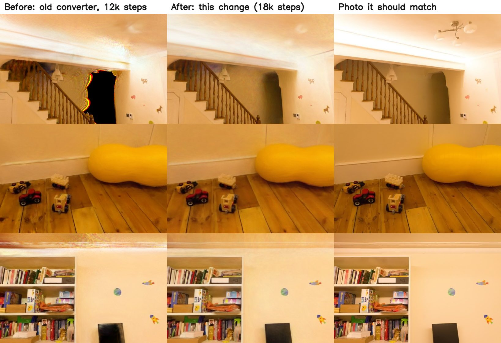

# AI Digital Twin Generator

Turn a short smartphone walkthrough video into an interactive digital twin: object detection, room segmentation, floor plans, seating analytics, PDF reports, an AI assistant, and a Gaussian Splat 3D viewer.

Built as an MCA major project. The web app runs entirely on CPU -- no NVIDIA GPU is required for the detection pipeline.

---

## Features

- **Authentication** -- JWT signup/login, bcrypt password hashing, project ownership enforced on every endpoint.
- **Video or photo processing pipeline** (runs async after upload; a scan is made from a video, or from 15 to 300 photos of the place):
  1. FFmpeg extracts frames
  2. COLMAP (via `pycolmap`) recovers the camera path and a sparse 3D point cloud
  3. YOLOv8 (ONNX Runtime, CPU) detects objects; each sighting is placed on the floor in 3D and merged across frames, so counts and positions are real
  4. Room size, floor area, ceiling height and free floor space are estimated from the reconstruction
  5. Brush trains a photorealistic Gaussian splat of the room on the GPU (Metal on Mac, Vulkan/DX12 elsewhere), shown in the browser viewer
  6. If camera positions cannot be recovered the app falls back to 2D mode and says why
- **Interactive results** -- object inventory, 2D floor plan + heatmap, analytics dashboard, live status timeline.
- **PDF report export** (jsPDF) of the project results.
- **AI assistant** -- ask natural-language questions about the scanned space ("how big is the room?", "where is the TV?", "suggest a layout"). Answers can point at objects in the 3D model. Works offline with built-in rules, or with Gemini, Claude or a free local model (Ollama).
- **Gaussian Splat viewer** -- attach a trained `.ply` / `.splat` and explore the space in 3D in the browser (three.js + `@mkkellogg/gaussian-splats-3d`).
- **Multi-user workspace** -- one dashboard, many projects, per-project progress.

---

## Architecture

```
Browser (React + Vite)
   |  JWT Bearer
   v
FastAPI REST API
   |-- auth / projects / uploads / detections / chat
   |
   +--> Background pipeline (per upload)
   |      ffmpeg -> frames -> COLMAP camera path -> YOLOv8 (ONNX) detections
   |      -> objects placed on the floor in 3D, merged across frames
   |      -> zones (DBSCAN), room size, capacity, free space
   |      -> Brush trains the Gaussian splat (GPU) -> viewer
   |
   +--> SQLite (dev) / PostgreSQL (prod)
```

Uploads, extracted frames, previews and splats live under `backend/storage/` and are git-ignored. Files are served only through signed, expiring links.

---

## Tech stack

| Layer     | Choice |
|-----------|--------|
| Backend   | FastAPI, SQLAlchemy 2, Uvicorn, python-jose (JWT), passlib/bcrypt |
| Detection | YOLOv8n, ONNX Runtime (CPU), OpenCV, scikit-learn (DBSCAN) |
| 3D        | pycolmap (COLMAP) for camera poses, Brush for Gaussian splat training |
| Media     | FFmpeg (frame extraction; bundled via imageio-ffmpeg) |
| AI chat   | Gemini / Claude / any OpenAI-compatible server incl. Ollama (optional) + rule-based fallback |
| Frontend  | React 19, Vite, Tailwind CSS 4, Zustand, React Router 7 |
| UI / data | Recharts, jsPDF, three.js, `@mkkellogg/gaussian-splats-3d` |
| Tests     | pytest + FastAPI TestClient |

---

## Prerequisites

- **Python 3.11+** (developed and tested on 3.13)
- **Node.js 20.19+ or 22.12+** (required by Vite 8; developed on 22)
- **A graphics card with Vulkan, DirectX 12 or Metal** for the 3D trainer (NVIDIA is not required). Everything except the 3D model also works without one.
- FFmpeg is bundled (installed by `pip` through `imageio-ffmpeg`); you do not need to install it.

---

## Getting started

### 1. Backend

**Windows** (PowerShell, from the project folder):

```powershell
cd backend
python -m venv venv
venv\Scripts\activate
pip install -r requirements.txt
python scripts/install_brush.py        # the 3D trainer (about 160 MB, checksum-verified)
python scripts/setup_detector.py       # the object detector model (one-time export, a few minutes)
copy .env.example .env                 # then open .env and set JWT_SECRET_KEY to a long random string
python scripts/doctor.py --gpu-test    # checks everything and tests your graphics card
uvicorn app.main:app --port 8000
```

**macOS / Linux:**

```bash
cd backend
python -m venv venv && source venv/bin/activate
pip install -r requirements.txt
python scripts/install_brush.py
python scripts/setup_detector.py
cp .env.example .env                   # then set JWT_SECRET_KEY (openssl rand -hex 32)
python scripts/doctor.py --gpu-test
uvicorn app.main:app --port 8000
```

API docs: http://localhost:8000/docs

Model files and the trainer are large, so they are not in git. `setup_detector.py` runs the heavy exporter (ultralytics and PyTorch) in a temporary environment that is deleted afterwards; the app itself only needs the small ONNX file. If you skip it, scans still get a 3D model but no object detection. If you skip `install_brush.py`, scans get objects and a floor plan but no 3D model (use the demo scan, below).

`DATABASE_URL` is optional: leaving it empty creates a local SQLite database at `backend/storage/database.db`. Set `JWT_SECRET_KEY` to a long random value; if it is left empty the app falls back to an insecure development key.

### 2. Frontend

```bash
cd frontend
npm install
npm run dev
```

App: http://localhost:5173 (any other local port works too).

The frontend calls the API at `http://localhost:8000` by default. Set `VITE_API_URL` (for example in `frontend/.env.local`) to point it elsewhere.

### 3. See it working in one minute

Sign up, then press **Demo scan** on the dashboard. It adds a ready-made room with a 3D model, detected objects, floor plan, analytics and an assistant to talk to, with no trainer, GPU or video needed.

---

## Tests

```bash
cd backend
python -m pytest tests/ -q
```

Tests run against an isolated temporary SQLite database (configured in `tests/conftest.py`), so they never touch your development database and can run while the dev server is up.

---

## API overview

All project endpoints require `Authorization: Bearer <token>`.

| Method | Path                              | Purpose |
|--------|-----------------------------------|---------|
| POST   | `/auth/signup`                    | Create account, returns token |
| POST   | `/auth/login`                     | Sign in, returns token |
| GET    | `/projects`                       | List own projects |
| POST   | `/projects`                       | Create project |
| GET    | `/projects/{id}`                  | Project detail |
| PATCH  | `/projects/{id}`                  | Rename / update |
| DELETE | `/projects/{id}`                  | Delete project and its files |
| POST   | `/projects/{id}/upload`           | Upload walkthrough video (multipart field `file`) |
| POST   | `/projects/{id}/photos`           | Upload 15 to 300 photos instead of a video (multipart field `files`, repeated) |
| GET    | `/projects/{id}/status`           | Pipeline status + stage timeline |
| GET    | `/projects/{id}/objects`          | Detected objects, counts, positions |
| GET    | `/projects/{id}/analytics`        | Rooms, capacity, area (optional `?room_width_m=`) |
| POST   | `/projects/{id}/ask`              | Ask a question about the space |
| POST   | `/projects/{id}/splat`            | Attach a trained splat file (field `file`) |
| POST   | `/projects/demo`                  | Add the bundled demo scan (3D model, objects, plan) to your account |
| POST   | `/files/token`                    | Short-lived token for `/files/{id}/preview.jpg` and `/files/{id}/model.ply` |

Health check: `GET /health`

---

## If the 3D model does not show up

Run the doctor first. It checks everything and says exactly what to fix:

```bash
python backend/scripts/doctor.py --gpu-test
```

The usual causes, in order of how often they happen:

1. **The 3D trainer (Brush) is not installed, or its download failed.** Run `python backend/scripts/install_brush.py`: it resumes dropped downloads, checks the checksum, and prints what to do if it still fails. Without the trainer a new video still gives objects, floor plan and analytics, but the 3D tab says no model could be built.
   **If the download keeps failing** (slow or blocked connection, antivirus, proxy): open <https://github.com/ArthurBrussee/brush/releases/tag/v0.3.0> in your browser, download `brush-app-x86_64-pc-windows-msvc.zip` (Windows), save it inside `backend\tools\` and run the script again; it unpacks the file you saved. If Windows Security removes `brush_app.exe`, add an exclusion for `backend\tools` and run it again.
2. **The graphics card ran out of memory** (common on 4 GB laptop GPUs such as the RTX 3050). The app retries once with lighter settings by itself. To start light every time, put this in `backend/.env`: `SPLAT_MAX_SPLATS=300000` and `SPLAT_MAX_RESOLUTION=800`.
3. **Windows picked the wrong GPU** on a laptop with two (Intel/AMD plus NVIDIA). Open Windows *Settings > System > Display > Graphics*, add `chrome.exe` (or Edge) and `python.exe`, and set both to *High performance*. In Chrome also turn on *Settings > System > Use graphics acceleration*, then check `chrome://gpu` says WebGL2 is hardware accelerated.
4. **Missing runtime on Windows.** Install the *Microsoft Visual C++ Redistributable (x64)*.
5. **Non-English characters in the folder path** (for example a user name with an accent). Move the project to a folder like `C:\twin`.
6. **The object detector model is missing.** Objects are skipped but the 3D model still builds. Export it once (see "Model weights").

**No GPU, or no time to train? Use the demo scan.** On the dashboard press **Demo scan**. It adds a ready-made room (3D model, objects, floor plan, analytics and assistant) that works on any computer with no trainer and no video. It comes from a public sample (see `backend/demo/README.md`); make one from your own scan with `python backend/scripts/export_demo.py <project-id>`.

---

## The assistant

Out of the box the assistant uses built-in rules (counts, capacity, room size, free space, "where is the TV?", layout ideas). For free-form questions, pick a language model in `backend/.env`:

```bash
LLM_PROVIDER=ollama        # free, runs on your computer (install from ollama.com, then `ollama pull llama3.2`)
LLM_MODEL=llama3.2

# or a hosted model:
LLM_PROVIDER=gemini        # or: anthropic
LLM_API_KEY=your-key
```

The model only ever sees the scan's structured data (object counts and positions, zones, room size), never the video. The app deliberately ignores generic keys such as `ANTHROPIC_API_KEY` in your shell: only `LLM_PROVIDER` and `LLM_API_KEY` in `.env` choose where your data goes.

---

## Real 3D models

Each upload builds its own Gaussian splat. This needs two things beyond `pip install`:

1. `pycolmap` (already in `requirements.txt`): camera positions. Runs on CPU, about 3 minutes for 200 frames.
2. **Brush**, the splat trainer. `python backend/scripts/install_brush.py` downloads the right build for your OS from <https://github.com/ArthurBrussee/brush/releases>, checks its checksum and unpacks it under `backend/tools/`. The app finds it there, or set `BRUSH_PATH`. Brush needs a GPU with Metal, Vulkan or DX12 but **not** NVIDIA.

Training takes about 25 minutes on an Apple M4 at the default `SPLAT_QUALITY=high`, and proportionally longer on a slower card. `fast` (about 8 minutes), `balanced` (14), `high` (25) and `max` (47) trade time for sharpness; measured against photos the model never saw, the browser view scores 26.0, 26.5, 27.4 and 28.0 dB respectively (the converter before this tuning scored 22.6 dB). Set it in `backend/.env`, or use `python scripts/retrain.py <project-id>` to rebuild the 3D model of an older scan with the current settings.



The two biggest causes of a blurry, smeary model were both found by rendering the same camera positions in the app's own viewer and comparing with photos: (1) the converter threw away every splat under 5% opacity, which is 46% of them, because Brush builds walls and ceilings out of hundreds of thousands of faint splats, leaving black holes and noise; (2) Brush never stops adding splats in a run shorter than 30000 steps, so short runs were never polished. Both are fixed. Training steps matter less than they look: Brush's own render improves by 0.2 dB from 12000 to 30000 steps, the browser view by 2 dB. Objects, floor plan and analytics are available as soon as the camera path is found; the 3D tab shows progress until the model is ready.

**Photos instead of a video.** The 3D engine only needs overlapping pictures of a place, so on the project page you can choose **Choose photos** (or drop several photos) instead of a video: 15 to 300 JPG, PNG, WebP or HEIC files, about 60 to 100 for a room. They go through exactly the same steps as video frames: each is rotated by its phone orientation flag, scaled to 720 px on the short side and linked in the order of their file names (IMG_2 before IMG_10). If the photos are not all the same shape (portrait and landscape mixed) each gets its own camera model instead of one shared one. Take them like a video would be filmed, with the same rules: about 60 to 80% of each photo shared with the next, step sideways between shots along the walls instead of turning on the spot, same camera and lens, no zoom, steady light, sharp, no flash, furniture and wall detail in view. iPhone HEIC photos need `pillow-heif` (in `requirements.txt`); without it, export them as JPG. Tested on 112 photos cut from the playroom footage (a real set of photos has not been tried).

**Video filmed by turning on the spot.** Depth comes from seeing the same point from different places. The app measures this for every scan (the median angle at which each 3D point was seen from; 25 degrees for a walk around the playroom, 5.9 for a 10 second pan from one spot) and below 10 degrees it says so in the Analytics notes and switches the photoreal viewer to a **look-around mode**: the camera stays where the phone stood and only turns, because from anywhere else the model smears. Anything the phone never pointed at is black. No training setting fixes missing depth: on a pan like this, 7000 steps predicted unseen frames 2.6 dB worse than 18000, and penalising large splats (`--scale-loss-weight 1e-6`) made them 2.5 dB worse.

**Short videos get more frames.** Frames too far apart cannot be linked into a camera path (on the playroom sample 2 of 28 placed with every 8th frame, 83% with every 3rd), so a short clip is sampled at up to 12 frames per second instead of 4, aiming at about 240 frames. On the 10 second pan this predicted unseen frames 1.1 dB better (SSIM 0.845 against 0.799), at about 6 minutes more training. Frames are still scaled to 720 px on the short side even if the video is smaller: native 480 px frames registered far fewer (23 of 36 against 39 of 39).

For a good model: walk slowly in a loop around the room's edge, keep lighting even, avoid blank walls and pointing at windows, and film 30 to 60 seconds. If fewer than about a third of the frames can be placed in 3D, the app tells you and keeps the 2D results.

**Scale is an estimate.** Structure-from-motion has no absolute scale, so sizes assume the phone was held at 1.4 m (cross-checked against a typical 2.5 m ceiling). Enter a tape-measured side on the Analytics tab to correct it. `scripts/evaluate.py` compares a scan against your measurements and hand counts.

You can still attach a splat trained elsewhere (Luma, Polycam, KIRI Engine) on the 3D tab for older scans.

**Two ways to see the 3D result.** *Photoreal* is the trained Gaussian splat (needs the trainer and a GPU). *Structure* shows the 3D geometry recovered from your video itself: the colored point cloud, the room box, the camera path with a camera icon at each pose, and the detected objects. It needs no GPU and is available as soon as the camera path is solved, so it also shows while the photoreal model trains, and it remains if training fails.

**The floor plan** draws the room with straight walls, furniture at typical real size, dimension chips, a scale bar and the room area. Click an object for its details and "Show in 3D"; drag to move, Ctrl/Cmd + scroll to zoom, double-click to fit. Toggles show the path the phone walked, a density map and object names. The PDF report uses the same drawing.

**Interacting with the model:** orbit, zoom and fullscreen; **Walkthrough** replays the path you filmed; labels float on detected objects; "Show in 3D" in the Objects tab, the floor plan and the assistant flies to an object.

**Measure** (3D viewer, either view): click two points to read the distance in metres. If you know the real length of something you measured (a door frame, a sheet of A4, a tape laid on the floor), press "I know this length" and type it (`2.1`, `210 cm`, `7 ft`). That replaces the 1.4 m camera-height guess for the whole scan: the floor plan, room size, assistant answers and PDF all use it from then on, and it is saved with the scan. "Reset" goes back to the estimate. Measurements are only as good as the picked points: use the two ends of something long and clear, not a tiny object.

**Record** (3D viewer, Photoreal): plays the walkthrough and saves it as a video (MP4 where the browser can, otherwise WebM), with no buttons or labels in the picture. Chrome, Edge and Safari can do it. Press "Stop and save" to keep what was filmed so far.

**Viewer note:** cross-origin isolation headers (`COOP`/`COEP`) are not enabled in the dev server, so the viewer sets `sharedMemoryForWorkers: false`. Without that, the splat sort worker silently fails and the canvas stays blank.

### Doors, windows and lights (optional)

The standard model (COCO) knows chairs and TVs but not doors, windows, lights or built-in cupboards. For those, run once:

```bash
python scripts/setup_detector.py --open-vocab
```

It exports an open-vocabulary YOLO-World model to ONNX in a temporary environment (about 370 MB of one-time downloads, needs Git, AGPL/GPL licence), and writes `backend/models/open_vocab.onnx` and `open_vocab.json`. The app then uses it next to the standard model, with no other setup. Process a video again, or run `python scripts/reanalyze.py <project-id>` on an existing scan, to see them. `python scripts/doctor.py` says whether it is installed.

Doors and windows are drawn **in the walls** of the floor plan (a door with its swing, a window as glazing). They are the least reliable thing the app detects. On the playroom sample the model scored the real window 0.13, and scored a wall book rack, a heater and a chalkboard 0.09 to 0.14 as "window": confidence cannot tell them apart. So the app is **precision-first**: a door or window is only kept when it stays at 0.2 or more on average over at least three frames (`MIN_CONFIDENCE` in `spatial.py`), and on that sample none passes. A clearer, brighter window should. Wording matters for doors but not for windows. Six different window wordings all scored 0.09 to 0.14 on the sample and all produced false hits. For doors, in a probe model, "white door" scored 0.20 on the curtained doorway that the plain prompt "door" missed, and "cupboard door" scored up to 0.65 on the real panelled door but just as high on cupboards and bookcases. The shipped prompts were not changed; adding "white door" and "wooden door" as extra prompts for `door` is the obvious next experiment. A larger YOLO-World model might also help, at the cost of size and speed.

---

## Project structure

```
backend/
  app/
    api/          auth, projects, uploads, detections, chat routers
    core/         config, database, security
    models/       SQLAlchemy models
    schemas/      Pydantic schemas
    services/     pipeline, detector, extractor, analytics, capacity,
                  segment_rooms, calibrate, preview, chat, storage
  models/         YOLOv8n ONNX weights (git-ignored)
  storage/        uploads, frames, splats, database (git-ignored)
  tests/          pytest suite + isolated test DB config
frontend/
  src/
    components/   SplatViewer, FloorPlan, StatusTimeline, ChatPanel, ...
    pages/        Login, Signup, Dashboard, ProjectDetail
    stores/       Zustand auth store
    lib/          axios client
```

---

## Known limitations

- **Sizes are estimates** (see "Scale is an estimate"). Typical error is tens of percent until corrected with a measurement.
- **Counts can be wrong** when objects are hidden, look alike, or the video is blurry. An object must be seen in at least 2 frames to count.
- **CPU detection and training time.** Longer videos take proportionally longer.
- **Not detected without the optional model:** doors, windows, counters and lights.
- **Development storage.** Files are on local disk, served through short-lived signed links (`/files/...`). Use object storage and PostgreSQL for deployment.
- **`backend/requirements-core.txt`** is a Phase-1 subset (auth/CRUD only). Use `backend/requirements.txt` for the full app.

---

## License

No license file has been added yet. All rights reserved by default -- add a `LICENSE` before publishing publicly if you intend to allow reuse.
